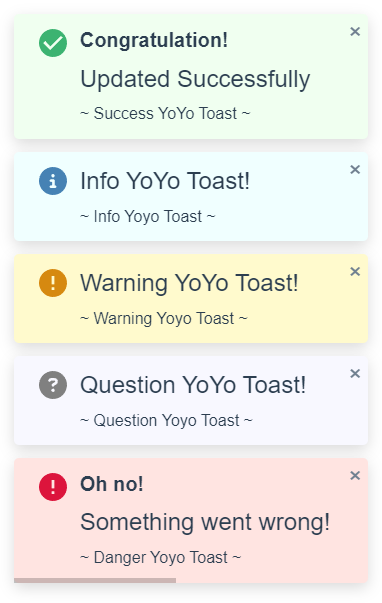

# Yoyo Toast

## Author
- Yeo
- smallvi@gmail.com

## Introduction

This plugin provides a customizable toast without any dependencies.

## Screenshot



## Installation

Include the following files in your project:

- `yoyo-toast.min.css`
- `yoyo-toast.min.js`

## Usage

1. Include `yoyo-toast.min.css` and `yoyo-toast.min.js` in your HTML file:

   ```html
   <link rel="stylesheet" href="path/to/yoyo-toast.min.css">
   <script src="path/to/yoyo-toast.min.js"></script>
   ```

2. Initialize the plugin in your JavaScript:
    
    ### Simple Yoyo Toast

    ```javascript
    yoyoToast.fire({
        type: 'danger',
        message: 'Danger YoYo Toast!',
    });
    ```
    
    ### Advance Yoyo Toast

    ```javascript
    yoyoToast.fire({
        type: 'success',
        title: 'Congratulation!',
        message: 'Updated Successfully',
        subtext: '~ Success YoYo Toast ~',
        timeout: 0,
        position: 'top-right'
    });
    ```

## Param

- type: Icon type {'info','question','success','warning','danger'}
- title: Title Text (optional)
- message: Main Text
- subtext: Sub Text (optional)
- timeOut: auto close modal (1000 = 1 sec),
- position: {'top-left', 'top-right', 'bottom-left', 'bottom-right'}

## Sample

[Demo](https://smallvi.github.io/yoyo_toast/)

## License

This project is licensed under the MIT License - see the [LICENSE](LICENSE) file for details.