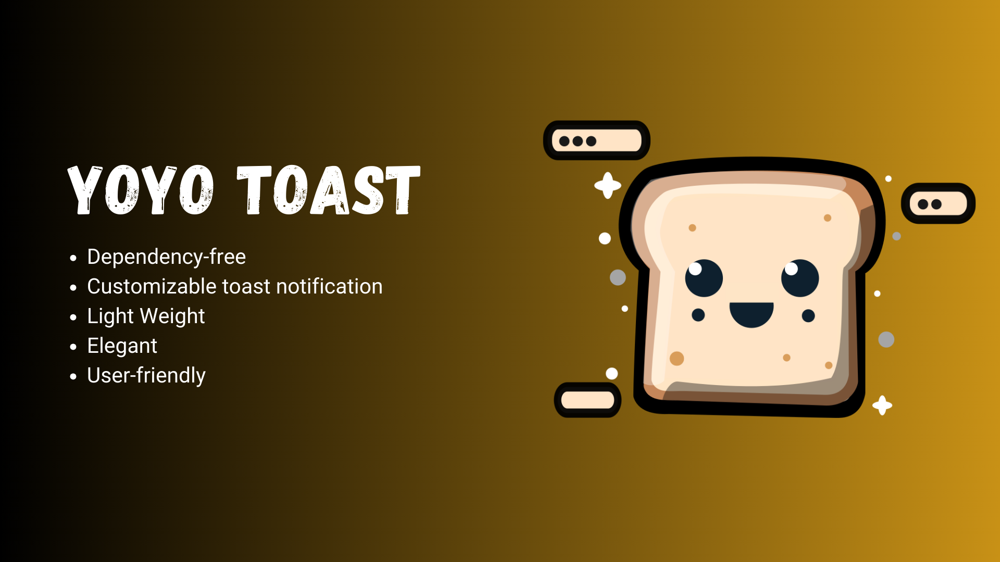

# Yoyo Toast



[View Demo](https://smallvi.github.io/projects/yoyoToast/)

## Introduction

Yoyo Toast is a customizable toast notification plugin that operates without any dependencies. It's designed for simplicity and flexibility, enabling you to create sleek and effective toast notifications for your website or application.

## Screenshot


## Installation

- #### Install Package

```bash
# npm
npm install yoyo-toast

# yarn
yarn add yoyo-toast
```

```javascript
import { yoyoToast } from './node_modules/yoyo-toast/dist/yoyoToast.min.mjs';
```

- #### CDN

```html
<!-- jsDelivr CDN -->
<script src="https://cdn.jsdelivr.net/gh/smallvi/yoyoToast@latest/dist/yoyoToast.umd.min.js"></script>

<!-- unpkg CDN -->
<script src="https://unpkg.com/yoyo-toast@latest/dist/yoyoToast.umd.min.js"></script>
```

- #### Self Hosted

```html
<script src="path/to/yoyoToast.umd.min.js"></script>
```

- #### Self Hosted (ES6 Module)

```javascript
import { yoyoToast } from 'path/to/yoyoToast.mjs';
```

## Usage

### Simple Yoyo Toast

```javascript
yoyoToast.fire({
    type: 'danger',
    message: 'Danger YoYo Toast!',
});
```
    
### Advance Yoyo Toast

```javascript
yoyoToast.fire({
    type: 'info',
    title: 'Update Available',
    message: 'Update to 10.5.3',
    timeout: 10000,
    subtext: '~ Info Yoyo Toast ~',
    position: 'top-right',
    timeoutFunction: ()=> alert('Timeout Function called'),
    hasConfirmation: true,
    confirmLabel: 'Right!',
    confirmFunction: () => alert('Confirm Function Called'),
    hasCancellation: true,
    cancelLabel: 'Not Now',
    cancelFunction: () => alert('cancel function Called'),
});
```

## Param

- type: Icon type {'info','question','success','warning','danger'}
- title: Title Text (optional)
- message: Main Text
- subtext: Sub Text (optional)
- timeOut: Auto close modal after this time (optional; in milliseconds; 1000 = 1 second),
- position: Display position {'top-left', 'top-right', 'bottom-left', 'bottom-right'} (Optional)
- timeoutFunction: function to call when timeout occurs (Optional)
- hasConfirmation: show confirm button if true (Optional)
- confirmLabel: Label for confirm button (Optional)
- confirmFunction: Function to call when confirm button is clicked (Optional)
- hasCancellation: Show cancel button if true (Optional)
- cancelLabel: Label for cancel button (Optional)
- cancelFunction: Function to call when cancel button is clicked (Optional)

## License

This project is licensed under the MIT License - see the [LICENSE](LICENSE) file for details.